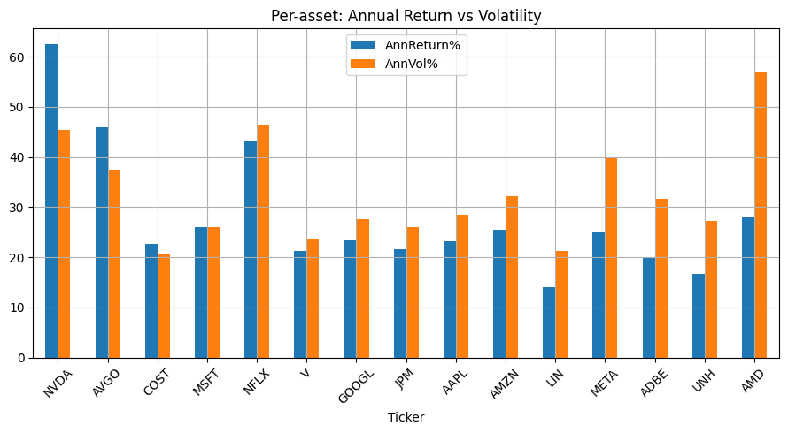
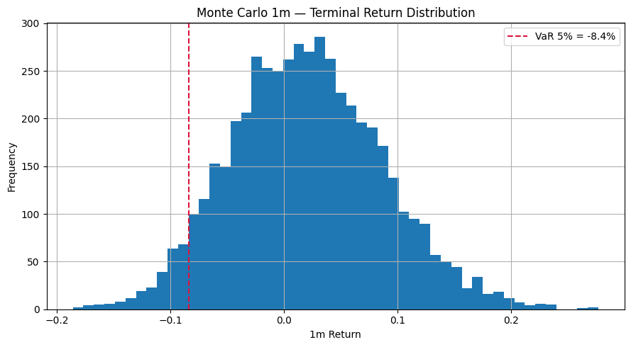

# Portfolio Analysis

Python notebook for building, analyzing, and monitoring an equity portfolio under realistic constraints.  
It provides both historical performance evaluation and forward-looking projections using Monte Carlo simulations.

## Features
- 📊 Risk/Return comparison (Return vs Volatility bar chart)
- 📉 Drawdown analysis of the best Sharpe ratio stocks
- 🔗 Correlation matrix across assets (sector overlap detection)
- 📈 Volatility vs Sharpe ratio dynamics
- 🧮 Portfolio construction with capital allocation rules
- 🏹 Efficient frontier and model portfolio comparison
- 🎲 Monte Carlo simulations for forward-looking scenarios

## Example Outputs

### Drawdown Analysis
Visualizes the worst peak-to-trough declines for the top Sharpe ratio stocks, highlighting downside risks.



### Monte Carlo Simulations
Simulates 5,000 one-month paths based on historical returns.  
- **Top chart:** median projection (blue line) and confidence intervals (dark blue = IQR 25–75%, beige = 5–95%).  
- **Bottom chart:** distribution of simulated one-month returns.



---

## Portfolio Construction Rules
- Initial capital: **USD 1,000,000**  
- Maximum allocation per stock: **20% of capital (USD 200,000)**  
- Target weights normalized to sum to 100%  
- No fractional shares; purchases at the most recent available price  
- Residual cash tracked as *Leftover before* and *Leftover after* (after the sweep procedure)  

---

## Requirements
- Python 3.9+
- Libraries: `numpy`, `pandas`, `matplotlib`, `statsmodels`, `yfinance`, `scipy`

Install with:
```bash
pip install -r requirements.txt
